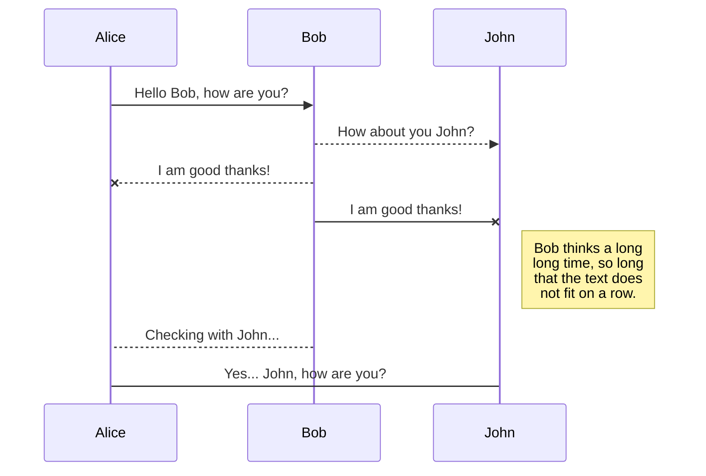

# a title

this
is
a
test

## links and images

[this is a link](https://google.com)


> this is a blockquote

> this is another

> this is a multiline
> blockquote

- a list
- a list
- a list

1. ordered list
2. ordered list
3. ordered list

1. ordered list
   some text

   more text!

   1. abcde
   2. qwerty
      - unordered
      - unordered
        multiple lines
   3. ordered sublist
2. ordered list
3. ordered list

```
code ``
```

some `inline code` test

| abc | def |
| --- | --- |
| bar | baz |

_italic_
**bold**

_nested **bold** italic_

Some math $f(x) = \int_{-\infty}^\infty\hat f(\xi)\,e^{2 \pi i \xi x}\,d\xi$

```javascript
console.log("hello");
```

and a flowchart


